# SupportPilot System Design

This is the implementation aligned design reference for SupportPilot. It describes architecture, data ownership, database schemas, relationships, workflows, safety controls, background work, and tradeoffs.

## 1. Architectural Rules

```txt
Every business record belongs to an organization.
Every protected request checks active membership and permission.
The AI can propose tools but cannot call providers directly.
Risky side effects require human approval.
External side effects use idempotency keys.
Timeline and audit records explain important actions.
PostgreSQL is the durable source of truth.
Redis is for rate limits, events, and optional task transport.
```

## 2. Components and Ownership

```txt
Next.js          owns presentation, Zustand, TanStack Query, and SSE display
FastAPI          owns auth, tenant scope, domain rules, and transactions
PostgreSQL       owns durable relational and vector data
Redis            owns rate limits, event bus, and optional task transport
Clerk            owns identity and sign in or sign up UX
LangGraph        owns agent state, graph execution, and checkpoint resume
Tool gateway     owns registry, scope, risk, idempotency, and execution
UrbanKart client owns provider protocol and request logging
Celery worker    owns optional task execution
Celery Beat      owns optional periodic scheduling
```

Layer direction:

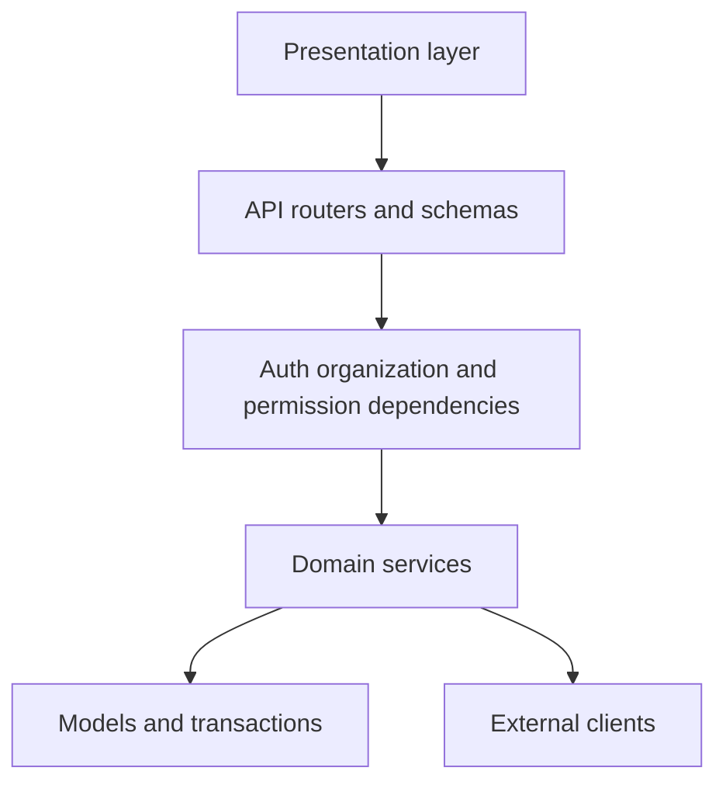

## 3. Main Request Flows

Authenticated:

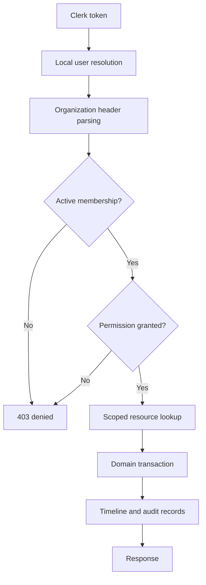

Public intake:

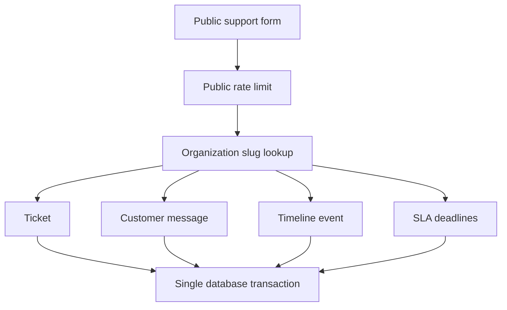

External intake:

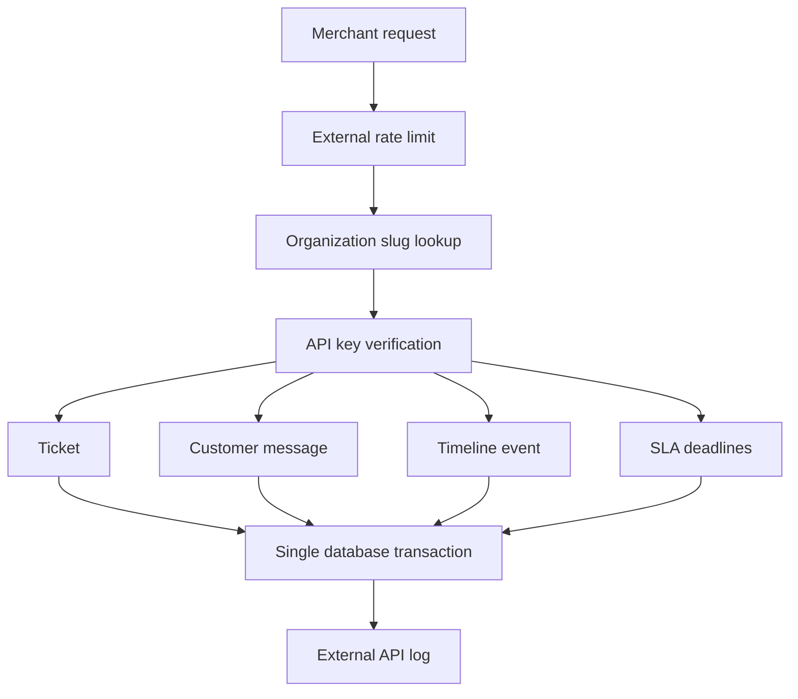

## 4. Database Platform and Migration Chain

```txt
PostgreSQL
PostgreSQL vector extension
SQLAlchemy 2
Alembic
pgvector vector(384)
```

Migration graph:

```mermaid
flowchart LR
	M1[0001 pgvector] --> M2[0002 auth organizations RBAC]
	M2 --> M3[0003 integrations logs]
	M3 --> M4[0004 tickets]
	M4 --> M5[0005 lifecycle]
	M5 --> M6[0006 knowledge]
	M6 --> M7[0007 agent]
	M7 --> M8[0008 tools]
	M8 --> M9[0009 approvals]
	M9 --> M10[0010 customer replies]
	M10 --> M11[0011 invitations]
	M11 --> M12[0012 SLA]
	M12 --> M13[0013 audit logs]
	M13 --> M14[0014 Cloudinary knowledge fields]
```

Expected head: `0014_cloudinary_knowledge`.

Notation: `PK` primary key, `NN` non null, `FK` foreign key, `J` JSONB, `ts` timestamptz, `V(384)` vector(384).

## 5. Complete Database Schemas

All UUID primary keys use ORM `uuid4`. Timestamp columns generally use `now()` server defaults and update timestamps use ORM or database update behavior as defined by the model.

### users

```txt
id uuid PK
clerk_user_id varchar(255), nullable, unique
email varchar(255), NN, unique
name varchar(255), nullable
avatar_url varchar(500), nullable
created_at ts NN
updated_at ts NN
```

### organizations

```txt
id uuid PK
name varchar(255), NN
slug varchar(255), NN, unique
support_email varchar(255), nullable
plan varchar(50), NN, default FREE
created_at ts NN
updated_at ts NN
```

### organization_members

```txt
id uuid PK
organization_id uuid NN FK organizations.id CASCADE
user_id uuid NN FK users.id CASCADE
role varchar(50) NN default SUPPORT_AGENT
status varchar(50) NN default ACTIVE
created_at ts NN
updated_at ts NN
```

Unique: organization plus user.

### organization_invitations

```txt
id uuid PK
organization_id uuid NN FK organizations.id CASCADE
email varchar(255) NN
name varchar(255), nullable
role varchar(50) NN
status varchar(30) NN default PENDING
invited_by_user_id uuid nullable FK users.id SET NULL
accepted_by_user_id uuid nullable FK users.id SET NULL
accepted_at ts nullable
created_at ts NN
updated_at ts NN
```

Indexes: organization, email, organization plus email plus status.

### integration_connections

```txt
id uuid PK
organization_id uuid NN FK organizations.id CASCADE
provider varchar(50) NN default URBANKART
base_url varchar(500) NN
encrypted_api_key text NN
status varchar(50) NN default ACTIVE
last_health_status varchar(50) nullable
last_health_message text nullable
last_checked_at ts nullable
created_at ts NN
updated_at ts NN
```

Unique: organization plus provider.

### external_api_logs

```txt
id uuid PK
organization_id uuid NN FK organizations.id CASCADE
integration_connection_id uuid nullable FK integration_connections.id SET NULL
provider varchar(50) NN
method varchar(20) NN
endpoint varchar(500) NN
status varchar(50) NN
status_code integer nullable
duration_ms integer nullable
request_payload J nullable
response_payload J nullable
error_message text nullable
created_at ts NN
```

### tickets

```txt
id uuid PK
organization_id uuid NN FK organizations.id CASCADE
ticket_number varchar(50) NN
subject varchar(255) NN
description text NN
status varchar(50) NN default OPEN
status_changed_at ts nullable
status_changed_by_user_id uuid nullable FK users.id SET NULL
status_reason text nullable
priority varchar(50) NN default MEDIUM
category varchar(80) NN default OTHER
source varchar(50) NN default SUPPORT_FORM
customer_name varchar(255) nullable
customer_email varchar(255) NN
customer_phone varchar(50) nullable
external_order_id varchar(100) nullable
assigned_to_user_id uuid nullable FK users.id SET NULL
created_by_user_id uuid nullable FK users.id SET NULL
first_response_at ts nullable
resolved_at ts nullable
closed_at ts nullable
first_response_due_at ts nullable
resolution_due_at ts nullable
sla_status varchar(50) NN default OK
sla_near_breach_notified_at ts nullable
sla_breached_at ts nullable
ai_summary text nullable
ai_confidence_score integer nullable
metadata_json J nullable
created_at ts NN
updated_at ts NN
```

Unique: organization plus ticket number. Indexes cover organization, ticket number, status, priority, category, customer, order, assignee, and timestamps.

### ticket_messages

```txt
id uuid PK
organization_id uuid NN FK organizations.id CASCADE
ticket_id uuid NN FK tickets.id CASCADE
sender_type varchar(50) NN default CUSTOMER
sender_user_id uuid nullable FK users.id SET NULL
sender_name varchar(255) nullable
sender_email varchar(255) nullable
body text NN
is_public boolean NN default true
metadata_json J nullable
created_at ts NN
```

### ticket_internal_notes

```txt
id uuid PK
organization_id uuid NN FK organizations.id CASCADE
ticket_id uuid NN FK tickets.id CASCADE
author_user_id uuid nullable FK users.id SET NULL
body text NN
metadata_json J nullable
created_at ts NN
```

### ticket_timeline_events

```txt
id uuid PK
organization_id uuid NN FK organizations.id CASCADE
ticket_id uuid NN FK tickets.id CASCADE
actor_user_id uuid nullable FK users.id SET NULL
event_type varchar(80) NN default TICKET_CREATED
title varchar(255) NN
description text nullable
old_value varchar(255) nullable
new_value varchar(255) nullable
metadata_json J nullable
created_at ts NN
```

### ticket_status_transitions

```txt
id uuid PK
organization_id uuid NN FK organizations.id CASCADE
ticket_id uuid NN FK tickets.id CASCADE
actor_user_id uuid nullable FK users.id SET NULL
from_status varchar(50) NN
to_status varchar(50) NN
trigger varchar(80) NN default AGENT_ACTION
reason text nullable
is_allowed boolean NN default true
blocked_reason text nullable
metadata_json J nullable
created_at ts NN
```

### knowledge_documents

```txt
id uuid PK
organization_id uuid NN FK organizations.id CASCADE
title varchar(255) NN
document_type varchar(80) NN default OTHER
status varchar(50) NN default DRAFT
content text NN
source_url varchar(1000) nullable
version integer NN default 1
ingestion_status varchar(50) NN default PENDING
ingestion_error text nullable
chunk_count integer NN default 0
metadata_json J nullable
created_by_user_id uuid nullable FK users.id SET NULL
updated_by_user_id uuid nullable FK users.id SET NULL
ingested_at ts nullable
cloudinary_public_id varchar(500) nullable
cloudinary_url varchar(2000) nullable
file_name varchar(500) nullable
file_size integer nullable
file_type varchar(100) nullable
content_extraction_status varchar(50) nullable default pending
created_at ts NN
updated_at ts NN
```

Unique: organization plus title. Indexes cover organization, status, ingestion, file metadata, and Cloudinary ID.

### knowledge_chunks

```txt
id uuid PK
organization_id uuid NN FK organizations.id CASCADE
document_id uuid NN FK knowledge_documents.id CASCADE
chunk_index integer NN
content text NN
token_count integer NN default 0
embedding V(384) NN
metadata_json J nullable
created_at ts NN
```

Indexes include organization, document, and IVFFlat cosine embedding index.

### agent_runs

```txt
id uuid PK
organization_id uuid NN FK organizations.id CASCADE
ticket_id uuid NN FK tickets.id CASCADE
started_by_user_id uuid nullable FK users.id SET NULL
status varchar(50) NN default STARTED
provider varchar(50) NN default mock
model_name varchar(100) nullable
detected_category varchar(80) nullable
detected_priority varchar(50) nullable
risk_level varchar(50) NN default LOW
decision varchar(80) NN default NO_ACTION
draft_response text nullable
reasoning_summary text nullable
planned_tools J nullable
retrieved_context J nullable
final_state J nullable
error_message text nullable
duration_ms integer nullable
created_at ts NN
completed_at ts nullable
```

### agent_run_steps

```txt
id uuid PK
organization_id uuid NN FK organizations.id CASCADE
agent_run_id uuid NN FK agent_runs.id CASCADE
ticket_id uuid NN FK tickets.id CASCADE
step_name varchar(100) NN
status varchar(50) NN default STARTED
input_json J nullable
output_json J nullable
error_message text nullable
duration_ms integer nullable
created_at ts NN
completed_at ts nullable
```

### tool_executions

```txt
id uuid PK
organization_id uuid NN FK organizations.id CASCADE
ticket_id uuid nullable FK tickets.id CASCADE
agent_run_id uuid nullable FK agent_runs.id CASCADE
requested_by_user_id uuid nullable FK users.id SET NULL
tool_name varchar(100) NN
risk_level varchar(50) NN default READ_ONLY
status varchar(80) NN default STARTED
approval_status varchar(80) NN default NOT_REQUIRED
idempotency_key varchar(255) nullable
input_args J nullable
output_json J nullable
error_message text nullable
duration_ms integer nullable
created_at ts NN
completed_at ts nullable
```

Unique: organization plus idempotency key.

### approval_requests

```txt
id uuid PK
organization_id uuid NN FK organizations.id CASCADE
ticket_id uuid nullable FK tickets.id CASCADE
agent_run_id uuid nullable FK agent_runs.id SET NULL
tool_execution_id uuid nullable FK tool_executions.id CASCADE
requested_by_user_id uuid nullable FK users.id SET NULL
decided_by_user_id uuid nullable FK users.id SET NULL
request_type varchar(80) NN default TOOL_EXECUTION
status varchar(50) NN default PENDING
title varchar(255) NN
description text nullable
risk_level varchar(50) NN default HIGH_RISK_WRITE
tool_name varchar(100) nullable
input_args J nullable
request_reason text nullable
decision_reason text nullable
result_json J nullable
metadata_json J nullable
created_at ts NN
decided_at ts nullable
```

Unique: organization plus tool execution.

### customer_reply_drafts

```txt
id uuid PK
organization_id uuid NN FK organizations.id CASCADE
ticket_id uuid NN FK tickets.id CASCADE
agent_run_id uuid nullable FK agent_runs.id SET NULL
approval_request_id uuid nullable FK approval_requests.id SET NULL
created_by_user_id uuid nullable FK users.id SET NULL
updated_by_user_id uuid nullable FK users.id SET NULL
approved_by_user_id uuid nullable FK users.id SET NULL
rejected_by_user_id uuid nullable FK users.id SET NULL
sent_by_user_id uuid nullable FK users.id SET NULL
sent_message_id uuid nullable FK ticket_messages.id SET NULL
source varchar(50) NN default AGENT
status varchar(50) NN default DRAFT
subject varchar(255) nullable
body text NN
rejection_reason text nullable
approval_reason text nullable
send_notes text nullable
metadata_json J nullable
created_at ts NN
updated_at ts NN
approved_at ts nullable
rejected_at ts nullable
sent_at ts nullable
```

### audit_logs

```txt
id uuid PK
organization_id uuid NN FK organizations.id CASCADE
actor_user_id uuid nullable FK users.id SET NULL
action varchar(100) NN
resource_type varchar(100) NN
resource_id uuid nullable, polymorphic identifier
ticket_id uuid nullable FK tickets.id SET NULL
agent_run_id uuid nullable FK agent_runs.id SET NULL
tool_execution_id uuid nullable FK tool_executions.id SET NULL
approval_request_id uuid nullable FK approval_requests.id SET NULL
reply_draft_id uuid nullable FK customer_reply_drafts.id SET NULL
description text nullable
metadata_json JSON nullable
ip_address varchar(100) nullable
user_agent text nullable
created_at ts NN
```

Resource IDs are polymorphic by design and do not have foreign keys to every possible resource.

## 6. Relationship and Delete Rules

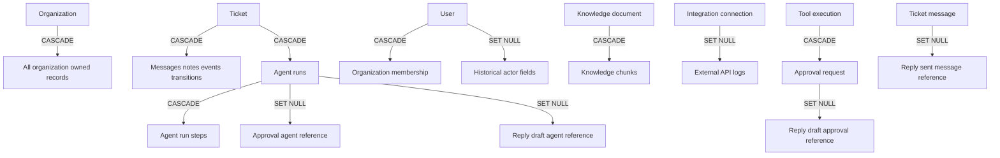

Explicit ORM relationships include users memberships, organization members, ticket children, document chunks, agent run steps, and inverse ticket relationships. Some foreign keys intentionally have no ORM relationship because they are used only as scoped references.

## 7. Agent Graph

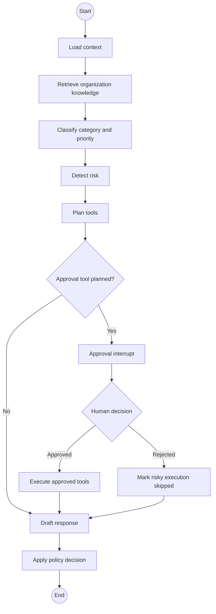

The graph uses a PostgreSQL checkpoint thread keyed by agent run ID. Approval resumes the same graph with `Command(resume=...)`. Unknown tools cannot pass the registry. Refund and replacement executors require approval.

## 8. RAG

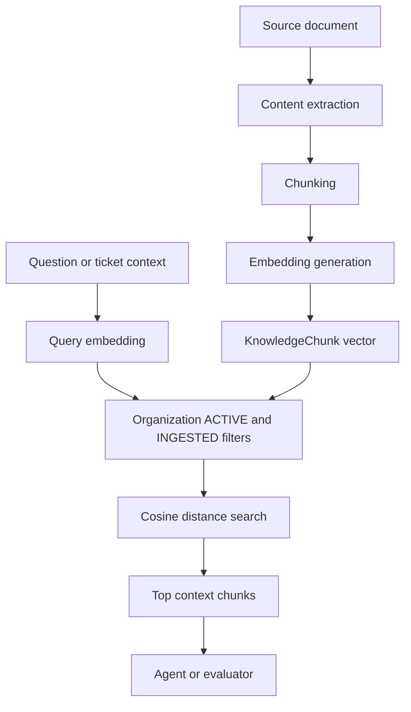

RAGAS builds records with question, answer, contexts, and ground truth. It evaluates context precision, context recall, faithfulness, and answer relevancy. It uses external model providers and is manual, synchronous, and excluded from production scheduling.

## 9. SLA and Scheduling

The shared `run_sla_check(db)` function is called either by Celery task `tickets.check_sla` or by protected `POST /internal/jobs/check-sla`.

Free MVP:

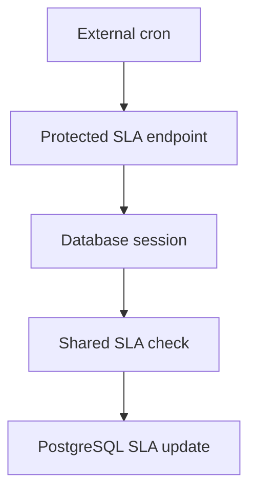

Scalable deployment:

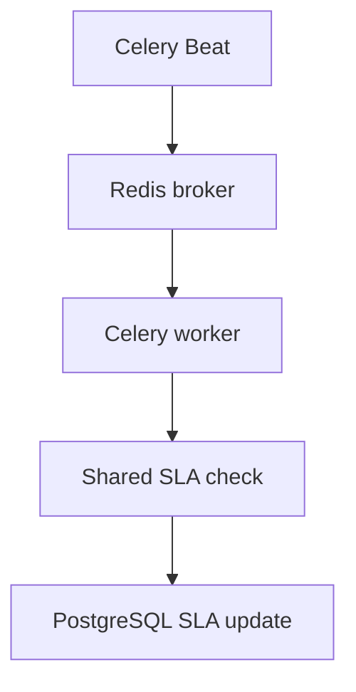

Only one scheduler may be active for an environment.

## 10. Security

```txt
Clerk JWT verification
Active membership check
Role permission check
Organization scoped queries
Encrypted integration keys
Constant time external key comparison
Strict production CORS
Security headers
Redis rate limits
Trusted proxy configuration
Safe errors
Audit records
```

Production startup rejects development auth, weak secrets, missing Clerk settings, wildcard CORS, and localhost CORS origins.

## 11. Failure Handling

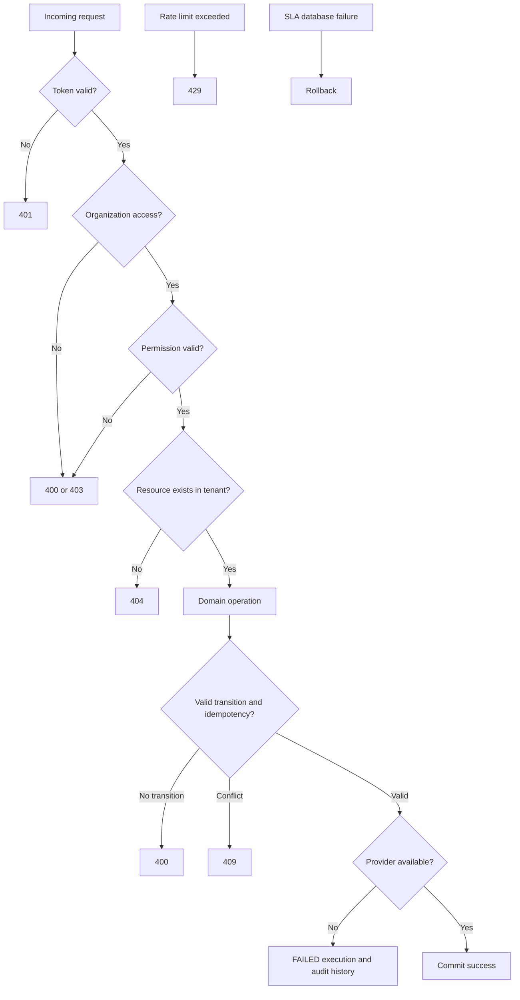

## 12. Tradeoffs and Boundaries

```txt
Synchronous v1 agent runs are simple but consume API capacity.
PostgreSQL checkpoints make approval resume durable but couple graph startup to the database.
SSE is simpler than WebSockets for current server to client updates.
External cron avoids worker cost on free hosting.
Celery isolates long jobs but requires Redis and separate processes.
Email based invitations are simple but lack token delivery and tracking.
Only UrbanKart is currently a provider adapter.
```
